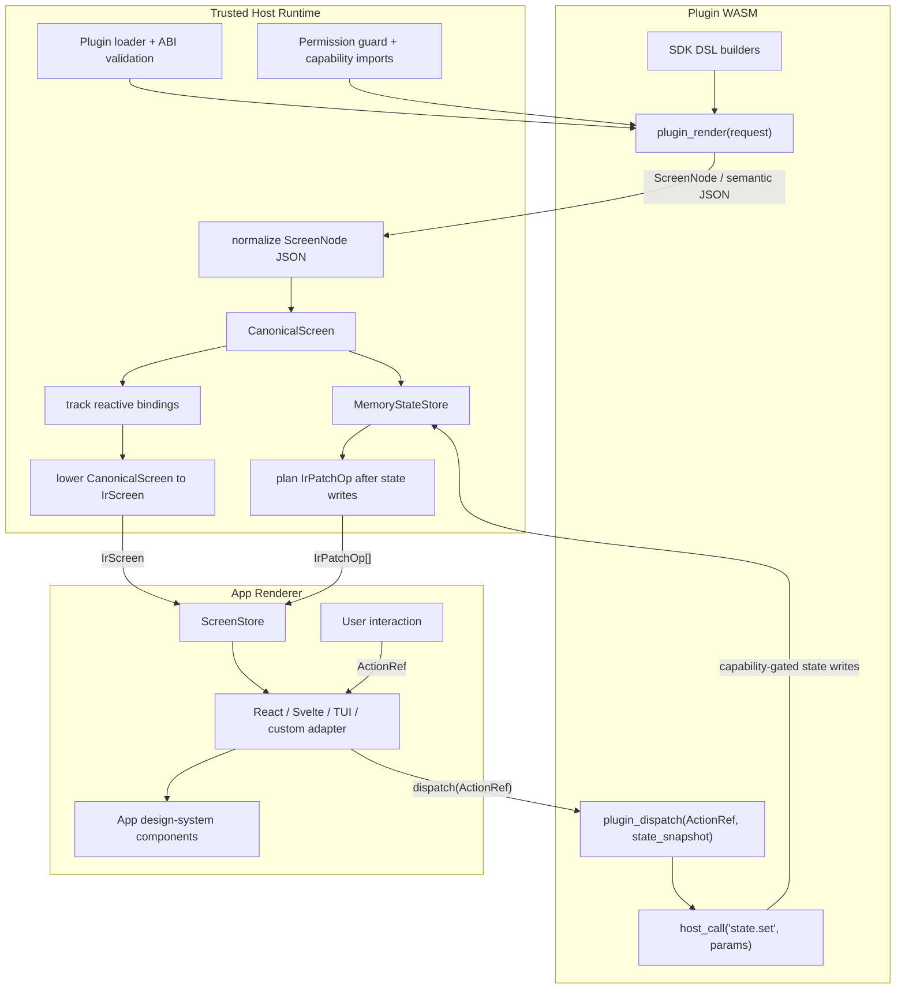

# Unode UI Flow

This diagram shows the current intent-based UI flow. Plugins emit semantic UI
data. The host owns normalization, state, reactivity, and IR lowering. Renderers
own presentation. User events return to plugins as symbolic actions, not as IR.

## Direction of data

| Direction | Payload | Owner |
|---|---|---|
| Plugin to host | `ScreenNode` / semantic JSON | Plugin authoring SDK |
| Host internal | `CanonicalScreen` | `unode` core |
| Host to renderer | `IrScreen` and `IrPatchOp` | `unode-web-host` or native host |
| Renderer to host/plugin | `ActionRef` | Renderer adapter + host runtime |
| Plugin to host capability | `host_call` envelopes | Permission-guarded host runtime |

The plugin does not choose DOM, CSS, terminal cells, React components, or Svelte
components. It describes intent. The trusted host turns that intent into a
canonical tree and renderer IR. The app renderer decides how that IR looks and
maps user interaction back to symbolic actions.
